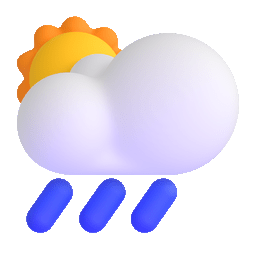

<div align="center">
  
# 🌦 GWeather - A Golang Weather CLI
GWeather is a command-line interface (CLI) written in Golang that provides weather forecasts using the WeatherAPI from RapidAPI.

<p align="center">
  
</p>

[](https://github.com/sponsors/zoelabbb)

[](https://github.com/zoelabbb)

</div>


## Installation

1. Clone the repository:
   ```bash
   git clone https://github.com/zoelabbb/Gweather.git
   ```

2. Navigate to the project directory:
   ```bash
   cd Gweather
   ```

3. Create a `.env` file with your RapidAPI key and host:
   ```env
   RAPID_API_KEY=your-rapidapi-key
   RAPID_API_HOST=weatherapi-com.p.rapidapi.com
   ```

4. Build the application:
   ```bash
   go build -o Gweather
   ```

5. Move the executable to your path:
   ```bash
   mv Gweather /usr/local/bin
   ```

6. Run the application:
   ```bash
   Gweather {city}
   ```

## Usage

Run the application with an optional city parameter to get the weather forecast. If no city is provided, it defaults to **"Denpasar"**.

```bash
Gweather Jakarta
```

## Dependencies

- [github.com/fatih/color](https://pkg.go.dev/github.com/fatih/color)
- [github.com/joho/godotenv](https://pkg.go.dev/github.com/joho/godotenv)

## Configuration

Configure the application by setting your RapidAPI key and host in the `.env` file.

## Contributing

1. Fork the repository (https://github.com/zoelabbb/Gweather/fork)
2. Create a new branch (`git checkout -b feature-new`)
3. Commit your changes (`git commit -am 'Add new feature'`)
4. Push to the branch (`git push origin feature-new`)
5. Create a new Pull Request

## Contact

For questions or suggestions, feel free to contact me:

- [Ryu as a Dev](mailto:alifryuuofficial@gmail.com)